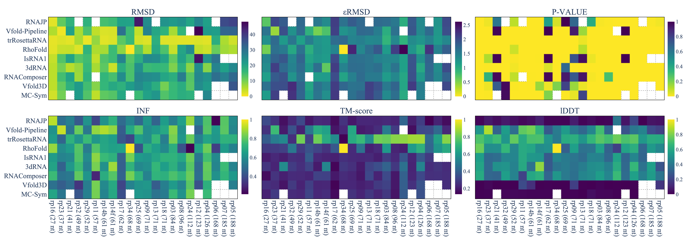

# State-of-the-RNArt visualisations

This code runs the different visualisations of the paper [TO DO]. 

All the different visualisations can be run in this repository. 




## Installation

The installations can be done to do the different visualisations. 

To do so, you can use: 
```bash
pip install -r requirements.txt
```

## Usage

To run the visualisations, one can use:
```bash
make viz
```
or 
```bash
python -m src.viz_cli
```

It will run all the visualisations and save them in the `docker_data/plots` folder.


## Metrics computation

You can find the different metrics computation in the `docker_data/output` folder.

There are metrics computation for the `RNA_PUZZLES` and `CASP_RNA` datasets (not complete for this dataset).

You can recompute the metrics by running:
```bash
make run
```
or 
```bash
python -m src.benchmark.score_computation
```

## Directory

This repository is organised as follows:
- `docker_data`: the different predictions from the nine benchmarked tools for `RNA_PUZZLES` and `CASP_RNA` datasets.
                 It also includes the different metrics computation for these datasets (in the `docker_data/output` folder).
                 The visualisations are saved in the `docker_data/plots` folder.
- `src`: the different scripts to run the visualisations and the metrics computation.
- `Makefile`: a Makefile to run the different scripts.
- `requirements.txt`: the different requirements to run the scripts.

## Citation

If you use this code, please cite the following paper:

```
```