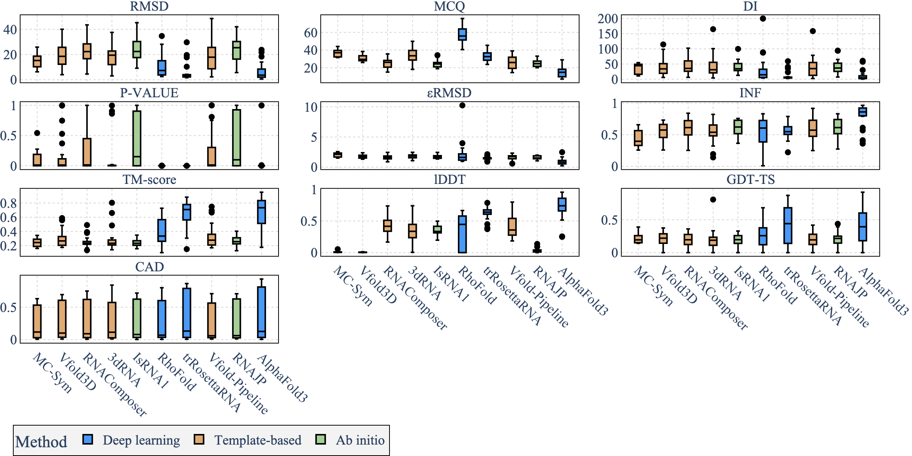
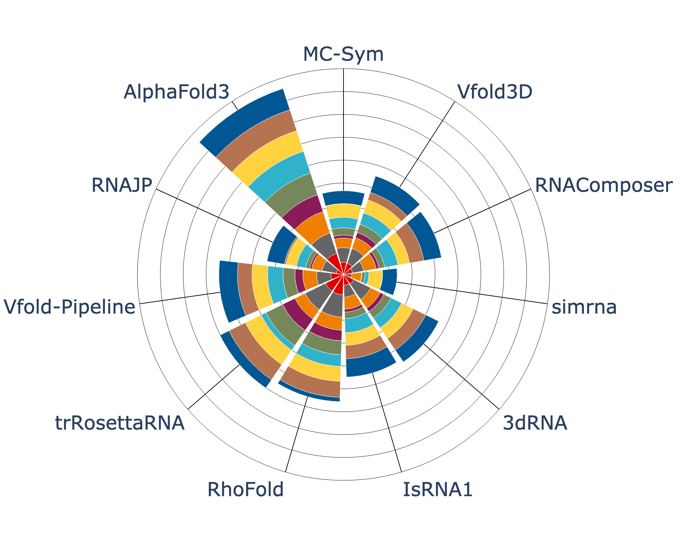
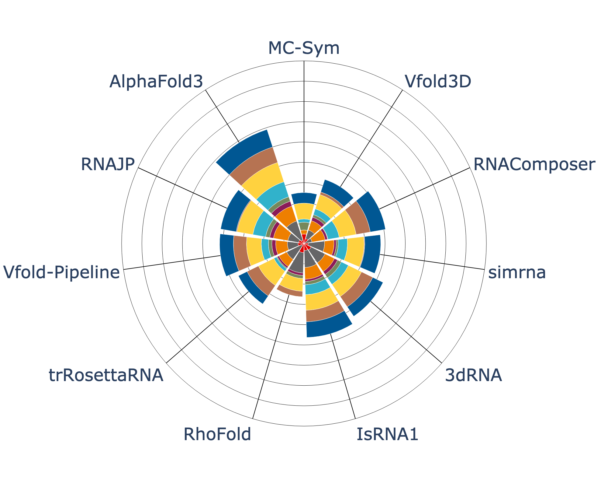

<div align="center">
<a href="https://doi.org/10.1093/nargab/lqae048" target="_blank" title="Go to article"></a>
<a name="readme-top"></a>

# State-of-the-RNArt visualisations


The code and the predictions from `State-of-the-RNArt` paper <br> with three test sets: `RNA_PUZZLES`, `CASP_RNA` and `RNASOLO`. <br> Code to run the different visualisations of the paper is available in this repository.

[![Article][article_img]][article_url]
[![License][repo_license_img]][repo_license_url]


<a href="https://doi.org/10.1093/nargab/lqae048" target="_blank" title="Go to article"></a>
<a name="readme-top"></a>


[![Update][update_img]][update_url]


We included predictions from `AlphaFold 3` as well as 10 other methods. <br> The predictions are available in the `docker_data` folder.

</div>

## Getting started

All the different visualisations can be run in this repository.

Here are some example of the available visualisations:

### Heatmap
RNASolo | RNA_Puzzles | CASP_RNA
:-------------------------:|:-------------------------:|:-------------------------:
 | | 

### Box plot
RNASolo |                    RNA_Puzzles                     | CASP_RNA
:-------------------------:|:--------------------------------------------------:|:-------------------------:
 |  | 

### Polar plot 
RNASolo | RNA_Puzzles | CASP_RNA
:-------------------------:|:-------------------------:|:-------------------------:
 | | 

## Installation

The installations can be done to do the different visualisations. 

To do so, you can use: 
```bash
pip install -r requirements.txt
```

## Usage

To run the visualisations, one can use:
```bash
make viz
```
or 
```bash
python -m src.viz_cli
```

It will run all the visualisations and save them in the `docker_data/plots` folder.


## Metrics computation

You can find the different metrics computation in the `docker_data/output` folder.

There are metrics computation for the `RNA_PUZZLES`,`CASP_RNA` and `RNASOLO` datasets.

You can recompute the metrics by running:
```bash
make run
```
or 
```bash
python -m src.benchmark.score_computation
```

## Directory

This repository is organised as follows:
- `docker_data`: the different predictions from the nine benchmarked tools for `RNA_PUZZLES`,`CASP_RNA` and `RNASOLO` datasets.
                 It also includes the different metrics computation for these datasets (in the `docker_data/output` folder).
                 The visualisations are saved in the `docker_data/plots` folder.
- `src`: the different scripts to run the visualisations and the metrics computation.
- `Makefile`: a Makefile to run the different scripts.
- `requirements.txt`: the different requirements to run the scripts.

## Citation

If you use this code, please cite the following paper:

```
Clément Bernard, Guillaume Postic, Sahar Ghannay, Fariza Tahi, 
State-of-the-RNArt: benchmarking current methods for RNA 3D structure prediction, 
NAR Genomics and Bioinformatics, Volume 6, Issue 2, June 2024, lqae048, 
https://doi.org/10.1093/nargab/lqae048
```

Or using the bibtex format:

```bibtex
@article{Bernard2024,
  author = {Clément Bernard and Guillaume Postic and Sahar Ghannay and Fariza Tahi},
  title = {State-of-the-RNArt: benchmarking current methods for RNA 3D structure prediction},
  journal = {NAR Genomics and Bioinformatics},
  volume = {6},
  number = {2},
  pages = {lqae048},
  year = {2024},
  month = {June},
  doi = {10.1093/nargab/lqae048},
  url = {https://doi.org/10.1093/nargab/lqae048}
}
```

<!-- Links -->

[article_img]: https://img.shields.io/badge/NAR_Genomics_and_Bioinformatics-Article-blue?style=for-the-badge&logo=none
[article_url]: https://doi.org/10.1093/nargab/lqae048
[repo_license_img]: https://img.shields.io/badge/license-Apache_2.0-red?style=for-the-badge&logo=none
[repo_license_url]: https://github.com/EvryRNA/state_of_the_rnart_viz/blob/main/LICENSE
[update_img]: https://img.shields.io/badge/Update_May_2024-AlphaFold3-green?style=for-the-badge&logo=none
[update_url]: https://github.com/EvryRNA/state_of_the_rnart_viz/blob/main
